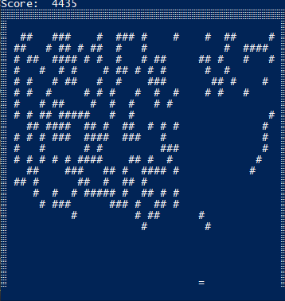

# Day 13: Care Package

Today's [puzzle](https://adventofcode.com/2019/day/13) was to built a brick game using the intcode computer from previous puzzles. The game logic is the intcode input while the simulation interprets intcode outputs (positions of elements and score updates) and passes inputs (move the paddle) to the intcode computer.

