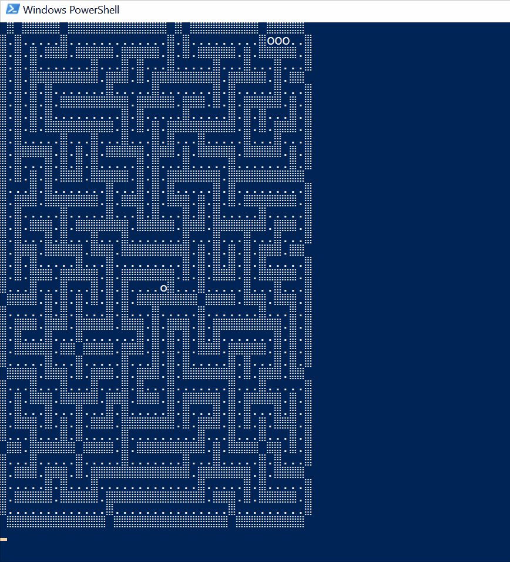

# Day 15: Oxygen System

[Puzzle](https://adventofcode.com/2019/day/15)

The GIF below shows how the repair bot explores the maze and finds the oxygen tank.

In the second part the oxygen tank has been fixed and the flow of oxygen through the space ship is simulated.
